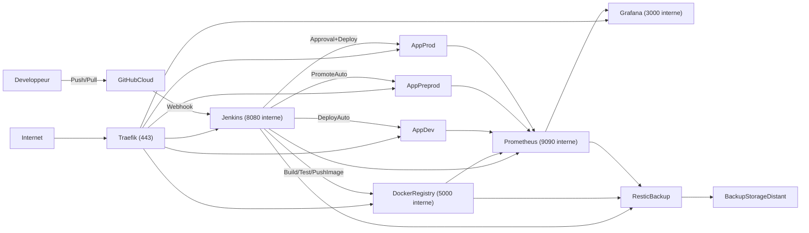
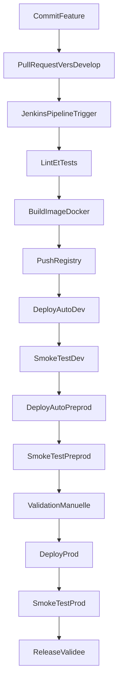
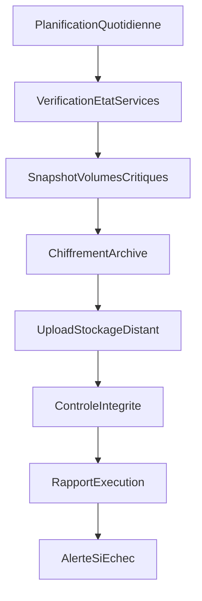
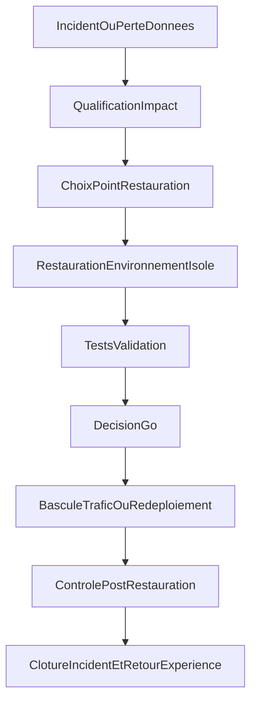
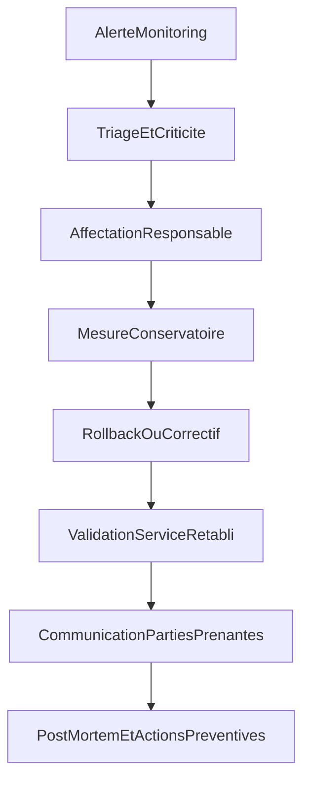

# CST Objectif 1 - Transformation digitale Furious Ducks

Version : 1.1  
Date : 07/05/2026  
Périmètre : objectif n°1 uniquement (workflow de production agence)  
Positionnement du document : cible projetée à implémenter (et non existant intégralement en place)

## Table des matières

- 1. Couverture et conventions
- A) État des lieux (As-Is)
- B) Méthodologie cible de gestion de projet (Scrum)
- C) Cadre DevOps / DevSecOps
- D) Analyse fonctionnelle du workflow CI/CD
- E) Architecture cible et choix techniques
- F) Hébergement, sécurité, sauvegardes et continuité
- G) Exigences mesurables et critères de validation
- H) Diagrammes infrastructure et procédures opérationnelles
- I) Gestion RH (fiche de poste + plan de formation)
- J) Planning, coûts et rentabilité
- K) Trame de défense en soutenance
- L) Annexes et preuves attendues

## 0) Couverture et conventions

### 0.1 Objet

Ce cahier spécifie la transformation digitale de l'agence Furious Ducks via la mise en place d'un workflow de production industrialisé.

### 0.2 Hypothèses validées

- Méthode projet : Scrum.
- CI principale : Jenkins.
- SCM : GitHub Cloud.
- Exécution applicative : Docker sur Linux.
- Observabilité standard : Prometheus + Grafana + Uptime Kuma.
- Déploiement production : validation manuelle (go/no-go).

### 0.3 Convention de lecture

Chaque section répond à trois questions :

- Pourquoi ce choix ?
- Comment le mettre en oeuvre ?
- Quelle preuve produire en soutenance ?

## A) État des lieux (As-Is)

### A.1 Contexte agence

Furious Ducks est une webagency qui souhaite industrialiser sa production pour absorber une croissance d'activité sans dégrader qualité ni délais.

### A.2 Problèmes identifiés

- Processus de livraison hétérogènes selon les projets.
- Intégration et déploiement majoritairement manuels.
- Visibilité limitée sur la qualité continue.
- Sauvegardes non unifiées et restauration peu testée.
- Risque de dépendance forte aux individus.

### A.3 Impacts métier

- Allongement du lead time de livraison.
- Variabilité de la qualité entre versions.
- Coût de correction plus élevé en fin de chaîne.
- Difficulté à garantir une disponibilité stable des services.

### A.4 Objectif To-Be

Mettre en place un workflow reproductible, mesurable et maintenable, capable de supporter plusieurs projets clients avec des standards communs.

## B) Méthodologie cible de gestion de projet (Scrum)

### B.1 Cadre retenu

Le pilotage du chantier workflow est organisé en Scrum avec des sprints courts, un backlog priorisé et des revues de sprint orientées preuve.

### B.2 Rôles

- Product Owner : priorise les besoins et valide la valeur livrée.
- Scrum Master : sécurise le cadre et supprime les blocages.
- Équipe projet : construit, teste et documente le workflow.

### B.3 Rituels

- Sprint Planning : objectifs du sprint et engagement.
- Daily : synchronisation opérationnelle.
- Sprint Review : démonstration de preuves techniques.
- Sprint Retrospective : amélioration continue.

### B.4 Définition of done (DoD) adaptée CI/CD

Une tâche est terminée seulement si :

- code versionné,
- pipeline vert,
- documentation mise à jour,
- preuve archivée (capture, log, rapport).

## C) Cadre DevOps / DevSecOps

### C.1 Vision DevOps

Le workflow rapproche développement et exploitation autour d'un pipeline commun, d'indicateurs partagés et de procédures standardisées.

### C.2 Extension DevSecOps

La sécurité est intégrée en continu :

- gestion des accès et rôles,
- gestion des secrets,
- journalisation des actions sensibles,
- politique de correctifs.

### C.3 Topologie d'équipe cible

- Build owner : fiabilité des pipelines.
- Run owner : disponibilité des services.
- Référent sécurité : contrôles minimaux et conformité process.

## D) Analyse fonctionnelle du workflow CI/CD

### D.1 Contraintes

- Stack Linux + Docker.
- Jenkins comme CI principale.
- Outils majoritairement open source.
- Déploiement prod sous contrôle manuel.

### D.2 Processus automatisé cible

1. Déclenchement pipeline via webhook GitHub.
2. Contrôles qualité (lint, tests, quality gate).
3. Build et versionnement de l'image Docker.
4. Publication en registry privée.
5. Déploiement automatique dev puis preprod.
6. Déploiement production après approbation.

### D.3 Standards d'exploitation

- Branching : GitFlow simplifié (`main`, `develop`, `feature/*`, `release/*`, `hotfix/*`).
- Versioning : SemVer.
- Secrets : jamais en clair dans le dépôt.
- Rollback : redéploiement de la dernière image stable taggée.

## E) Architecture cible et choix techniques

### E.1 Socle infrastructure

- Serveur dédié Linux (Ubuntu Server LTS).
- Docker Engine + Docker Compose.
- Durcissement minimal : pare-feu, SSH par clé, fail2ban, patch management.

### E.2 Briques techniques retenues

- Reverse proxy : Traefik (TLS et routage).
- CI : Jenkins (Jenkinsfile).
- SCM : GitHub Cloud (dépôts, pull requests, webhooks).
- Registry : Docker Registry privée.
- Observabilité : Prometheus + Grafana + Uptime Kuma.
- Sauvegarde : Restic + stockage distant.

### E.3 Justification de GitHub Cloud

GitHub Cloud est retenu pour :

- simplicité d'exploitation pour un contexte académique,
- adoption rapide par l'équipe,
- intégration native par webhook avec Jenkins.

Limite assumée :

- non auto-hébergé par défaut, compensé par une gouvernance d'accès stricte et une documentation des dépendances externes.

### E.4 Segmentation logique

- Zone publique : Traefik (HTTPS).
- Zone outils : Jenkins, registry, monitoring.
- Zone applicative : environnements dev, preprod, prod.
- Zone données : volumes persistants et sauvegardes.

### E.5 Nommage DNS recommandé

- `jenkins.wk-<classe>-<groupe>.fr`
- `registry.wk-<classe>-<groupe>.fr`
- `grafana.wk-<classe>-<groupe>.fr`
- `prometheus.wk-<classe>-<groupe>.fr`
- `app-dev.<domaine-projet>.fr`
- `app-preprod.<domaine-projet>.fr`
- `app.<domaine-projet>.fr`

## F) Hébergement, sécurité, sauvegardes et continuité

### F.1 Capacité cible

- Serveur dédié dimensionné selon charge projet (CPU, RAM, IOPS, bande passante).
- Réévaluation mensuelle de capacité selon KPI réels.

### F.2 Sécurité minimale

- TLS obligatoire sur les services exposés.
- MFA sur les comptes sensibles quand disponible.
- Comptes nominatifs et moindre privilège.
- Journalisation des actions administrateur.

### F.3 Politique de sauvegarde

- Sauvegarde quotidienne (rétention 30 jours).
- Sauvegarde hebdomadaire (rétention 12 semaines).
- Périmètre : Jenkins, registry, monitoring, bases applicatives, fichiers de configuration.

### F.4 Continuité de service

- RPO cible : <= 24h.
- RTO cible : <= 4h sur les services critiques.
- Exercice de restauration mensuel documenté.

## G) Exigences mesurables et critères de validation

### G.1 KPI CI/CD

| Domaine     | Indicateur                  | Cible           | Seuil d'alerte | Preuve attendue                     |
| ----------- | --------------------------- | --------------- | -------------- | ----------------------------------- |
| Build       | Durée pipeline standard     | <= 12 min       | > 15 min       | Historique Jenkins                  |
| Build       | Taux de succès pipeline     | >= 90 %         | < 85 %         | Rapport Jenkins (7 jours glissants) |
| Qualité     | Quality gate validée        | >= 85 %         | < 75 %         | Rapport qualité archivé             |
| Déploiement | Déploiements preprod        | >= 3/semaine    | < 1/semaine    | Journal des déploiements            |
| Livraison   | Lead time commit -> preprod | <= 1 jour ouvré | > 2 jours      | Horodatage GitHub/Jenkins           |

### G.2 KPI tests

| Domaine     | Indicateur               | Cible   | Seuil d'alerte | Preuve attendue       |
| ----------- | ------------------------ | ------- | -------------- | --------------------- |
| Unitaires   | Couverture code critique | >= 70 % | < 60 %         | Rapport coverage      |
| Unitaires   | Taux de succès tests     | >= 95 % | < 90 %         | Rapport pipeline      |
| Intégration | Smoke tests dev/preprod  | >= 98 % | < 95 %         | Logs post-déploiement |
| Régression  | Défauts critiques prod   | 0       | >= 1/mois      | Registre incidents    |

### G.3 SLO/SLA de disponibilité

| Service             | SLO    | SLA interne | Outil de mesure | Preuve attendue          |
| ------------------- | ------ | ----------- | --------------- | ------------------------ |
| Jenkins             | 99.0 % | 98.5 %      | Uptime Kuma     | Export mensuel uptime    |
| Registry            | 99.0 % | 98.5 %      | Uptime Kuma     | Export mensuel uptime    |
| Reverse proxy       | 99.5 % | 99.0 %      | Uptime Kuma     | Export mensuel uptime    |
| Preprod applicative | 99.0 % | 98.5 %      | Sondes HTTP     | Journal de disponibilité |

### G.4 Critères Go/No-Go production

Le passage en production est autorisé uniquement si :

- pipeline vert,
- image versionnée publiée,
- smoke test preprod validé,
- approbation manuelle tracée,
- plan de rollback disponible.

## H) Diagrammes infrastructure et procédures opérationnelles

### H.1 Diagramme d'infrastructure globale

### H.2 Procédure déploiement dev -> preprod -> prod

### H.3 Procédure sauvegarde

### H.4 Procédure restauration

### H.5 Procédure incident critique

## I) Gestion RH (fiche de poste + plan de formation)

### I.1 Fiche de poste cible

- Intitulé : Responsable workflow / DevOps.
- Mission principale : exploiter et fiabiliser la chaîne CI/CD.
- Activités : maintenance Jenkins, monitoring, sauvegardes, gestion incidents, amélioration continue.
- Compétences : Linux, Docker, Jenkins, GitHub, scripting, observabilité.
- Type de contrat et fourchette salariale : à calibrer selon politique RH client.

### I.2 Plan de formation

- Durée : 2 à 4 semaines.
- Parcours : architecture, outillage, procédures, sécurité, gestion incident.
- Validation : check-list hebdomadaire + exercice de restauration supervisé.

## J) Planning, coûts et rentabilité

### J.1 Macro-planning (5 semaines)

| Semaine | Lot principal                         | Livrable clé                                      |
| ------- | ------------------------------------- | ------------------------------------------------- |
| S1      | Cadrage + cahier technique            | Structure et hypothèses validées                  |
| S2      | Infrastructure + services coeur       | Jenkins, GitHub webhooks, registry, reverse proxy |
| S3      | Pipelines CI/CD                       | Déploiement dev/preprod/prod avec approval        |
| S4      | Monitoring + sauvegardes + procédures | Dashboards et test de restauration                |
| S5      | Chiffrage + dossier soutenance        | CST consolidé et argumentaire final               |

### J.2 Jalons projet

- J1 : architecture cible validée.
- J2 : pipeline bout en bout démontrable.
- J3 : sauvegarde/restauration testées.
- J4 : documentation opérationnelle finalisée.
- J5 : dossier prêt jury.

### J.3 Chiffrage estimatif (pédagogique réaliste)

#### Infra mensuelle

| Poste                    | Coût mensuel |
| ------------------------ | ------------ |
| Serveur dédié            | 90 EUR       |
| Stockage backup distant  | 20 EUR       |
| Domaine + DNS            | 3 EUR        |
| Outils observabilité OSS | 0 EUR        |
| **Total infra**          | **113 EUR**  |

#### Mise en place one-shot

| Poste                              | Coût          |
| ---------------------------------- | ------------- |
| Cadrage + spécifications           | 1800 EUR      |
| Installation infra + outillage     | 3000 EUR      |
| Pipelines et déploiement           | 3000 EUR      |
| Monitoring + backups + sécurité    | 2000 EUR      |
| Documentation + procédures + RH    | 1350 EUR      |
| Recette + soutenance + ajustements | 1350 EUR      |
| **Total one-shot**                 | **12500 EUR** |

#### Run mensuel humain

| Poste                            | Coût mensuel |
| -------------------------------- | ------------ |
| Maintenance corrective/évolutive | 1000 EUR     |
| Supervision et sauvegarde        | 500 EUR      |
| Support interne                  | 225 EUR      |
| **Total run humain**             | **1725 EUR** |

Coût mensuel global (infra + run) : **1838 EUR**

### J.4 Rentabilité attendue

- Réduction du lead time de livraison : 30 % à 50 %.
- Réduction des incidents de déploiement : environ 30 %.
- Diminution du coût de reprise grâce aux procédures normalisées.

## K) Trame de défense en soutenance

### K.1 Message de positionnement

Le workflow proposé répond aux contraintes du sujet tout en restant réaliste à implémenter dans un contexte académique.

### K.2 Pourquoi ces choix techniques

- Jenkins garantit la conformité au brief.
- GitHub Cloud accélère l'adoption et simplifie l'exploitation.
- Docker standardise les environnements et réduit les écarts.
- Observabilité standard donne une lecture exploitable sans complexité excessive.

### K.3 Risques couverts

- Risque de dérive qualité : quality gates et tests automatiques.
- Risque de rupture de service : supervision continue.
- Risque de perte de données : sauvegardes régulières et restauration testée.
- Risque de dérive coûts : pilotage mensuel par KPI.

### K.4 Mini script oral (2 minutes)

1. Problème initial et impacts métier.
2. Architecture cible et logique des choix.
3. Démonstration des métriques et du cycle de déploiement.
4. Preuves prévues pour attester la valeur.

## L) Annexes et preuves attendues

### L.1 Table flux/ports/protocoles

| Source     | Destination        | Port     | Protocole     | Usage                     |
| ---------- | ------------------ | -------- | ------------- | ------------------------- |
| Internet   | Traefik            | 443      | HTTPS         | Accès externe             |
| Traefik    | Jenkins            | 8080     | HTTP interne  | Interface et API CI       |
| Traefik    | Registry           | 5000     | HTTPS interne | Distribution images       |
| Jenkins    | Registry           | 5000     | HTTPS interne | Push/Pull images          |
| Jenkins    | Environnements app | 22/443   | SSH/HTTPS     | Déploiement               |
| Prometheus | Services monitorés | Variable | HTTP metrics  | Collecte métriques        |
| Services   | Stockage backup    | 443      | HTTPS         | Sauvegardes externalisées |

### L.2 Preuves minimales à annexer

- Capture d'un pipeline Jenkins complet et vert.
- Rapport de couverture tests.
- Export de disponibilité (Uptime/Grafana).
- Journal de sauvegarde + exercice de restauration.
- Journal de rollback de démonstration.
- Base de calcul des coûts et hypothèses.

