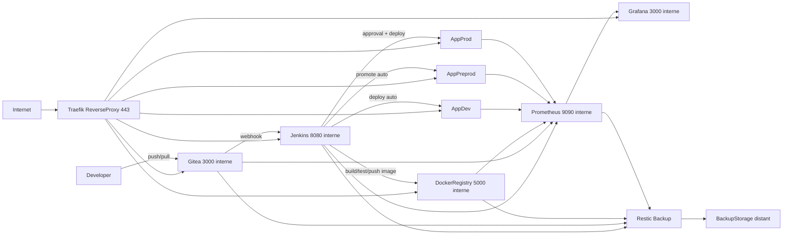
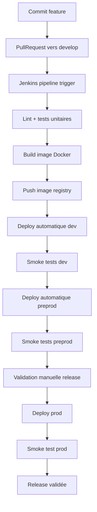
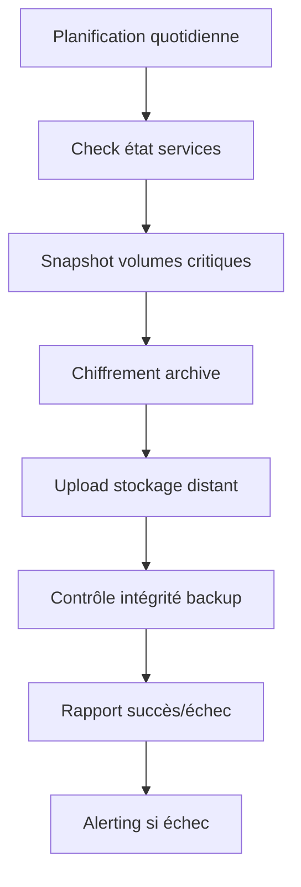
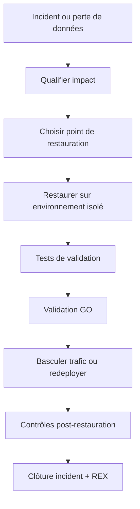
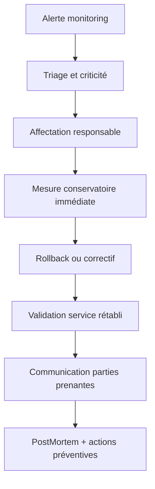

# Objectif n°1 - Diagrammes infrastructure et procédures (BPMN)

## 1) Diagramme d'infrastructure complet (workflow)

## 2) Procédure de déploiement dev/preprod/prod

## 3) Procédure de sauvegarde automatisée

## 4) Procédure de restauration (dev/preprod/prod)

## 5) Procédure de gestion d'incident critique

## 6) Table flux/ports/protocoles (à insérer dans le cahier)

| Source        | Destination        | Port      | Protocole     | Usage                     |
| ------------- | ------------------ | --------- | ------------- | ------------------------- |
| Internet      | Reverse proxy      | 443       | HTTPS         | Accès externe outils/apps |
| Reverse proxy | Jenkins            | 8080      | HTTP interne  | UI/API Jenkins            |
| Reverse proxy | Gitea              | 3000      | HTTP interne  | UI/API SCM                |
| Jenkins       | Registry           | 5000      | HTTPS interne | Push/Pull images          |
| Jenkins       | Environnements app | 22/443    | SSH/HTTPS     | Déploiement               |
| Prometheus    | Services monitorés | variables | HTTP metrics  | Collecte métriques        |
| Services      | Backup distant     | 443       | HTTPS         | Sauvegardes externalisées |

