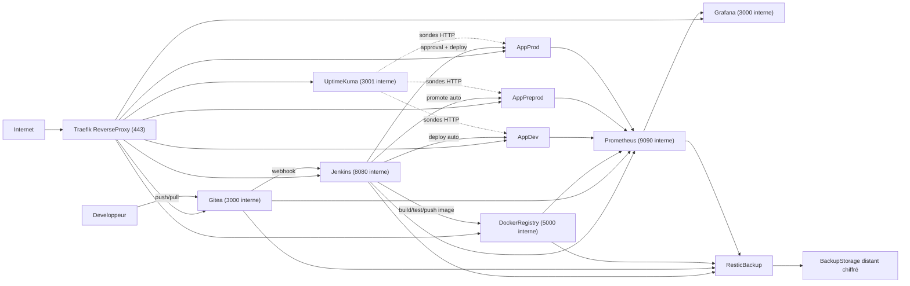
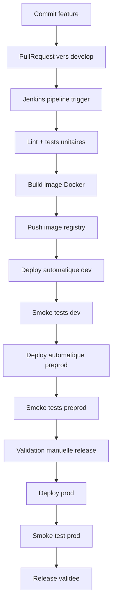
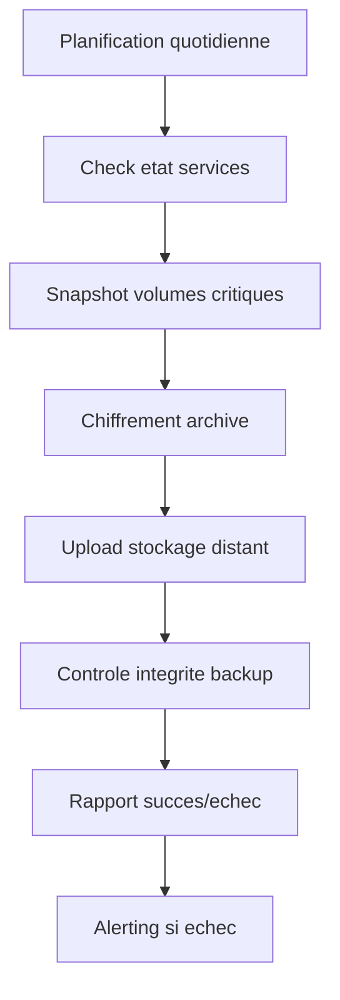
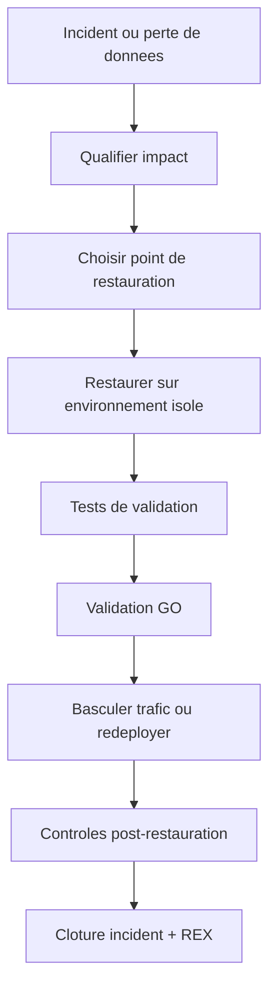
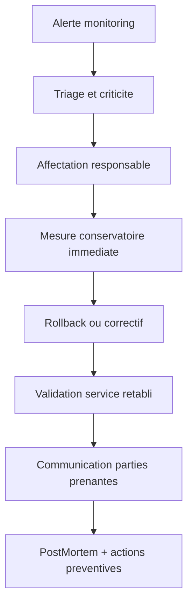
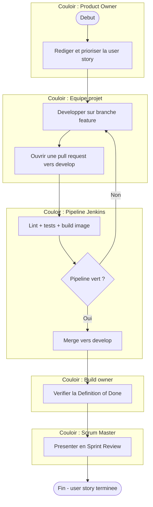
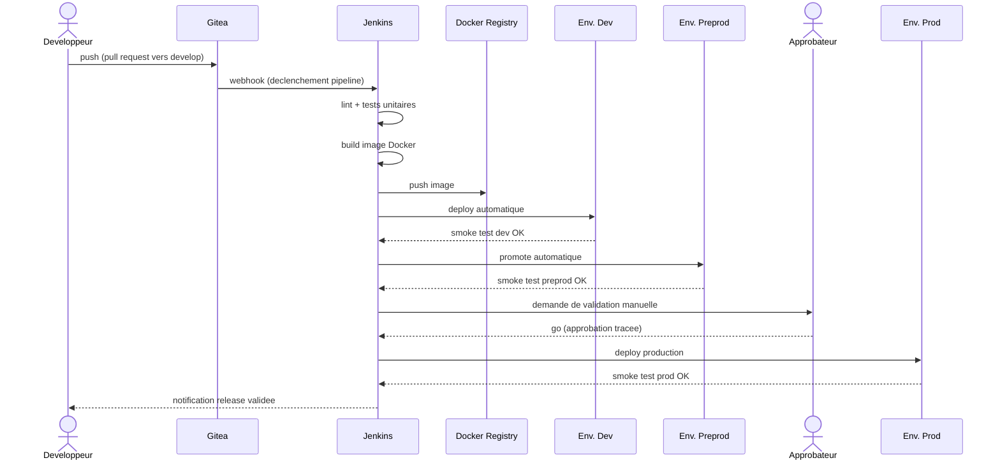
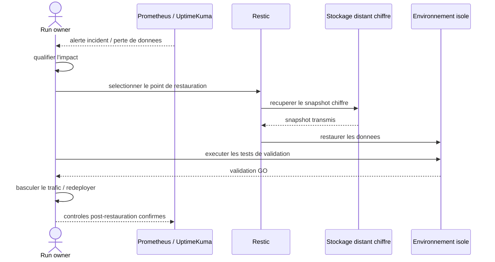
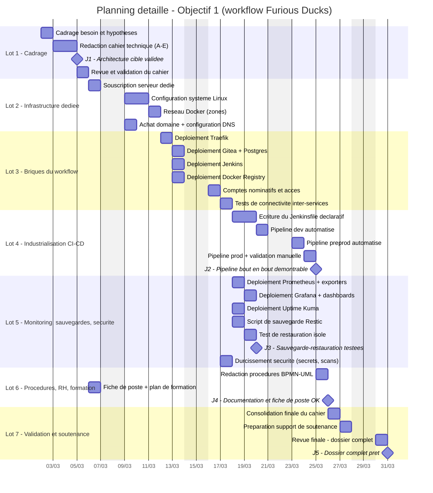

# Cahier des spécifications techniques - Workflow de production Furious Ducks

**Agence Furious Ducks - Objectif n°1 : Transformation digitale (workflow de production)**

| Champ | Valeur |
| --- | --- |
| Version | 2.0 (finale) |
| Date | à compléter lors de l'export |
| Rédacteurs | <Prénom NOM>, <Prénom NOM> |
| Statut | Cible projetée à implémenter (et non existante intégralement à ce jour) |
| Diffusion | Interne agence + jury de soutenance |

> **Note de mise en forme obligatoire** : ce document est la trame de contenu source. Lors de l'export final (Word/PDF), il doit être mis en page en **A4 portrait**, avec une **pagination interne au format `x/100`** (et non un simple numéro de page), conformément aux exigences du sujet. Le sommaire ci-dessous doit être complété avec les numéros de page réels après mise en page.

**Mentions légales de l'agence** (pied de page à reporter sur chaque page imprimée) : Furious Ducks - SAS au capital de 50 000 € - Siège social : 12 rue des Canards, 75011 Paris - RCS Paris 512 345 678 - SIREN 512 345 678 - SIRET 512 345 678 00021 - APE/NAF 6201Z - TVA intracommunautaire FR12 512345678. *(Données fictives à usage pédagogique, projet étudiant.)*

**Sources fusionnées dans ce document final** : `CST_Objectif1_Transformation_Digitale_Furious_Ducks.md`, `Objectif1_01_Structure_Cahier_Technique_Workflow.md`, `Objectif1_02_Architecture_Cible_Workflow.md`, `Objectif1_03_Exigences_Mesurables_KPI_SLO.md`, `Objectif1_04_Diagrammes_Infrastructure_BPMN.md`, `Objectif1_05_Planning_Couts_Argumentaire.md`. Ces fichiers sont conservés à la racine du projet comme historique de travail ; **ce document `rendu/` fait foi**.

---

## Sommaire

- 0. Couverture et conventions ..................................... (page)
- A. État des lieux ................................................ (page)
  - A.1 Présentation de l'agence
  - A.2 Problématique actuelle
  - A.3 Méthodologie actuelle
- B. Méthodologie de projet à venir (Scrum) ........................ (page)
- C. Introduction au DevOps / DevSecOps ............................ (page)
- D. Analyse du workflow CI/CD ..................................... (page)
  - D.1 Présentation du workflow CI/CD
  - D.2 Choix techniques
  - D.3 Hébergement et backups
- E. Exigences mesurables et critères de validation ................ (page)
- F. Diagramme d'infrastructure complet du workflow ................ (page)
- G. Gestion des ressources humaines ............................... (page)
  - G.1 Recrutement (fiche de poste)
  - G.2 Formation
- H. Procédures (BPMN) ............................................. (page)
- I. Diagramme de Gantt ............................................ (page)
- J. Estimation des coûts et rentabilité ........................... (page)
- K. Registre des risques .......................................... (page)
- Annexes ........................................................... (page)

---

## 0) Couverture et conventions

### 0.1 Objet du document

Ce cahier spécifie la transformation digitale de l'agence Furious Ducks via la mise en place d'un **workflow de production industrialisé**, conforme à la commande de M. Guido Brasletti (Objectif n°1 du projet).

### 0.2 Périmètre de preuve de ce cahier

Conformément à la structure officielle du cahier des spécifications techniques, l'Objectif n°1 consiste à **spécifier et concevoir** le workflow de production (préconisations techniques justifiées, diagrammes, procédures, coûts, RH). La structure imposée ne demande pas de fournir, à ce stade, des exemples d'exécution réelle (captures de pipeline, journaux de déploiement, etc.) : ce cahier est donc **autonome et complet** sans dépendre de l'avancement d'un autre projet. Les artefacts techniques fournis en complément (`rendu/workflow-technique/`) illustrent la faisabilité des choix retenus, indépendamment de tout projet client particulier.

### 0.3 Hypothèses et décisions structurantes validées

- Méthodologie de gestion de projet : **Scrum**.
- CI principale : **Jenkins** (imposé par le sujet).
- SCM : **Gitea auto-hébergé** (solution Git open source, conforme à l'exigence « SCM de type Git : Gitlab, Gitea... » et à la philosophie 100 % open source du sujet).
- Exécution applicative : **Docker** sur **Linux** (imposé par le sujet), pour le workflow lui-même comme pour les environnements qu'il gère (dev, préprod, prod).
- Observabilité : **Prometheus + Grafana + Uptime Kuma**.
- Sauvegardes : **Restic** + stockage distant chiffré.
- Déploiement production : automatisé jusqu'à la validation manuelle (go/no-go), puis déploiement automatique après approbation.
- Hébergement : **serveur dédié Linux**, choix assumé plutôt qu'une offre cloud managée, pour garder la maîtrise complète de la stack open source.

### 0.4 Convention de lecture

Chaque section répond à trois questions :

- **Pourquoi** ce choix ?
- **Comment** le mettre en œuvre ?
- **Quelle preuve** produire en soutenance ?

### 0.5 Versioning du document

| Version | Date | Auteur | Modifications |
| --- | --- | --- | --- |
| 1.0 | - | Équipe projet | Structure initiale et premiers contenus par section |
| 1.1 | - | Équipe projet | Consolidation des choix techniques et des KPI |
| 2.0 | - | Équipe projet | Fusion finale, correction SCM (Gitea), ajout registre des risques, RH détaillée |

---

## A) État des lieux

### A.1 Présentation de l'agence

Furious Ducks est une **webagency spécialisée dans les technologies open source**, fondée en 2007. Elle compte aujourd'hui **45 collaborateurs** et est dirigée par **M. Guido Brasletti**. En quinze ans d'existence, l'agence a construit une réputation solide sur la maîtrise des stacks libres, mais sa croissance rapide en nombre de projets clients a progressivement fait apparaître une désorganisation opérationnelle qui freine aujourd'hui son développement.

L'agence souhaite désormais structurer sa production pour absorber la croissance de son activité sans dégrader ni la qualité de ses livrables, ni ses délais, ni la confiance de ses clients.

**Informations juridiques** *(données fictives, projet étudiant)* :

| Champ | Valeur |
| --- | --- |
| Dénomination sociale | Furious Ducks |
| Statut juridique | SAS (Société par Actions Simplifiée) |
| Siège social | 12 rue des Canards, 75011 Paris |
| Capital social | 50 000 € |
| RCS | Paris 512 345 678 |
| SIREN | 512 345 678 |
| SIRET (siège) | 512 345 678 00021 |
| Code APE/NAF | 6201Z - Programmation informatique |
| TVA intracommunautaire | FR12 512345678 |

**Capacité opérationnelle** : 45 salariés, organisation actuelle en pôles projet (développement, design, gestion de projet), sans équipe dédiée à l'exploitation ou à l'industrialisation de la production (pas de pôle DevOps identifié à date).

### A.2 Problématique actuelle

M. Guido Brasletti a constaté qu'une désorganisation s'est progressivement installée, faisant perdre en efficacité à l'agence. Les irritants remontés sont les suivants, classés par criticité :

| Criticité | Irritant | Impact |
| --- | --- | --- |
| Haute | Absence de versionning structuré (pas de SCM commun, pratiques hétérogènes) | Perte de code, conflits, non-traçabilité des changements |
| Haute | Intégration et déploiement majoritairement manuels | Erreurs humaines, délais de livraison longs et variables |
| Haute | Absence de sauvegardes automatisées et unifiées | Risque de perte de données irréversible en cas d'incident |
| Moyenne | Procédures de mise en production inexistantes ou non formalisées | Dépendance forte à des individus clés, incidents de prod évitables |
| Moyenne | Visibilité limitée sur la qualité continue du code livré | Détection tardive des régressions, coût de correction élevé |
| Moyenne | Absence de méthodologie de gestion de projet homogène | Difficulté de pilotage inter-projets, reporting hétérogène |

**Exemple concret d'incident évitable** : lors d'une mise en production manuelle, l'absence de procédure de rollback documentée a entraîné plusieurs heures d'indisponibilité d'un site client, faute de pouvoir revenir rapidement à la version stable précédente.

**Impacts métier consolidés** :

- Allongement du lead time de livraison (délai entre le développement d'une fonctionnalité et sa mise à disposition).
- Variabilité de la qualité entre les versions livrées.
- Coût de correction plus élevé lorsque les anomalies sont détectées tardivement (en production plutôt qu'en intégration).
- Difficulté à garantir une disponibilité stable des services pour les clients.
- Risque de dépendance forte à des individus (perte de connaissance en cas de départ).

### A.3 Méthodologie actuelle

L'agence fonctionne aujourd'hui selon un **cycle en V** : les phases de spécification, conception, développement, tests et déploiement se succèdent de façon séquentielle et cloisonnée, avec une validation tardive (en fin de cycle) de la conformité du produit aux besoins exprimés.

**Points de rupture observés** :

- Validation métier tardive : les écarts ne sont détectés qu'en fin de projet, ce qui augmente le coût et la complexité des corrections.
- Intégration manuelle du code, réalisée en fin de développement, générant des conflits importants et des retours en arrière coûteux.
- Absence de boucle de retour rapide entre développeurs, testeurs et exploitants.
- Documentation de processus quasi inexistante, rendant la reproductibilité difficile d'un projet à l'autre.

**Mesure initiale (avant transformation)** : fréquence de déploiement estimée à moins d'une mise en production par mois et par projet, délai de livraison moyen non maîtrisé (dépendant fortement des disponibilités individuelles), aucun indicateur de qualité continue suivi à ce jour.

**Objectif To-Be** : mettre en place un **workflow reproductible, mesurable et maintenable**, capable de supporter plusieurs projets clients simultanément avec des standards communs, tout en gardant la stack 100 % open source imposée par le sujet.

---

## B) Méthodologie de projet à venir (Scrum)

### B.1 Cadre retenu et justification

Le pilotage du chantier « workflow » est organisé en **Scrum**, méthode agile itérative et incrémentale. Ce choix est justifié par :

- un besoin de livrer rapidement de la valeur visible (infrastructure, pipelines, dashboards) par petits incréments démontrables ;
- une meilleure absorption du changement pour des équipes historiquement habituées au cycle en V ;
- un cadre standardisé, avec des rôles et rituels connus, facilitant l'adoption et le pilotage par indicateurs.

**Limites assumées de Scrum** : nécessite une discipline d'équipe (rituels réguliers) et un Product Owner disponible ; moins adapté à des flux de demandes très continus et imprévisibles (dans ce cas, un mode Kanban serait complémentaire pour le support/run, cf. section C.3).

### B.2 Rôles

- **Product Owner** : priorise le backlog du chantier workflow et valide la valeur livrée à chaque sprint.
- **Scrum Master** : sécurise le cadre Scrum, facilite les rituels et lève les blocages de l'équipe.
- **Équipe projet** : construit, teste et documente le workflow (développeurs, ingénieur DevOps, testeur).

### B.3 Rituels et cadence

| Rituel | Fréquence | Objectif |
| --- | --- | --- |
| Sprint Planning | Début de sprint (toutes les 2 semaines) | Définir l'objectif du sprint et engager l'équipe |
| Daily Scrum | Quotidien (15 min) | Synchronisation opérationnelle, lever les blocages |
| Sprint Review | Fin de sprint | Démonstration des preuves techniques produites |
| Sprint Retrospective | Fin de sprint | Amélioration continue du fonctionnement d'équipe |

### B.4 Définition of Done (DoD) alignée CI/CD

Une tâche est considérée comme terminée uniquement si :

- le code est versionné dans Gitea ;
- le pipeline Jenkins associé est vert ;
- la documentation technique est mise à jour ;
- une preuve est archivée (capture d'écran, log d'exécution, rapport de test).

### B.5 Articulation avec le pipeline CI/CD

Chaque user story du backlog workflow est développée sur une branche dédiée, intégrée via pull request, et validée automatiquement par le pipeline Jenkins avant d'être mergée. La Sprint Review s'appuie directement sur les artefacts produits par le pipeline (rapports de tests, dashboards Grafana, journal de déploiement).

---

## C) Introduction au DevOps / DevSecOps

### C.1 Définition et vision appliquée à Furious Ducks

Le **DevOps** est une culture et un ensemble de pratiques visant à rapprocher les équipes de développement (Dev) et d'exploitation (Ops) autour d'un objectif commun : livrer plus vite, plus souvent et plus fiablement, grâce à l'automatisation et à des indicateurs partagés.

Appliqué à Furious Ducks, le DevOps se traduit par :

- un pipeline commun à tous les projets clients (industrialisation) ;
- des indicateurs partagés entre développeurs et exploitants (KPI CI/CD, disponibilité) ;
- des procédures standardisées (déploiement, sauvegarde, restauration, incident).

**Avantages** : réduction du lead time, détection précoce des anomalies, responsabilisation partagée développement/exploitation, montée en compétence transverse des équipes.

**Limites/vigilance** : nécessite un investissement initial en outillage et en formation ; risque de sur-outillage si la maturité de l'équipe n'est pas prise en compte progressivement (d'où le plan de montée en maturité ci-dessous).

### C.2 Extension DevSecOps

La sécurité est intégrée en continu dans le pipeline plutôt qu'en contrôle final :

- gestion des accès et des rôles (comptes nominatifs, moindre privilège) ;
- gestion des secrets (jamais en clair dans le dépôt Gitea, credentials Jenkins chiffrés) ;
- journalisation des actions sensibles (accès admin, déploiements, restaurations) ;
- politique de correctifs de sécurité (application sous 7 jours pour les failles critiques).

### C.3 Topologie d'équipe cible

| Rôle | Responsabilité principale |
| --- | --- |
| Build owner | Fiabilité et performance des pipelines CI/CD |
| Run owner | Disponibilité et supervision des services en exploitation |
| Référent sécurité | Contrôles minimaux, conformité des process, gestion des accès |

Cette topologie s'appuie sur le modèle **« You build it, you run it »** adapté : les équipes projet restent responsables de leurs applications, avec un support transverse (build/run/sécurité) mutualisé sur l'ensemble des projets clients de l'agence.

### C.4 Montée en maturité DevOps

| Horizon | Jalon de maturité |
| --- | --- |
| Court terme (0-2 mois) | Pipeline CI/CD fonctionnel de bout en bout, sauvegardes automatisées en place |
| Moyen terme (2-6 mois) | Généralisation du workflow à tous les nouveaux projets clients, dashboards de supervision consultés en routine |
| Long terme (6-12 mois) | Amélioration continue outillée (quality gates renforcés, tests automatisés étendus), autonomie complète de la ressource recrutée (cf. section G) |

### C.5 Matrice RACI

Légende : **R** = Responsible (réalise), **A** = Accountable (rend compte, décide en dernier ressort - une seule personne/rôle par ligne), **C** = Consulted (consulté avant décision), **I** = Informed (informé après action).

Rôles : **PO** = Product Owner, **SM** = Scrum Master, **BO** = Build owner, **RunO** = Run owner, **RS** = Référent sécurité, **EQ** = Équipe projet (développeurs/testeur), **DIR** = Direction (M. Brasletti).

| Activité | PO | SM | BO | RunO | RS | EQ | DIR |
| --- | --- | --- | --- | --- | --- | --- | --- |
| Cadrage et rédaction du cahier technique | A | I | I | I | I | R | C |
| Choix des briques technologiques (Traefik, Gitea, Jenkins...) | A | I | R | R | C | I | I |
| Mise en place de l'infrastructure serveur | I | I | C | A | I | R | I |
| Configuration des pipelines Jenkins | I | I | A | I | C | R | I |
| Configuration du SCM Gitea (branches, accès) | I | I | A | I | C | R | I |
| Mise en place du monitoring Prometheus/Grafana | I | I | C | A | I | R | I |
| Supervision de la disponibilité (Uptime Kuma) | I | - | I | A | - | R | I |
| Politique de sauvegarde (Restic) | I | - | I | A | C | R | I |
| Test de restauration périodique | I | - | C | A | I | R | I |
| Gestion des secrets et des accès | I | I | R | R | A | I | I |
| Validation manuelle go/no-go production | A | I | R | C | I | I | I |
| Gestion des incidents critiques | I | I | C | A | C | R | I |
| Revue hebdomadaire/mensuelle des KPI | A | I | R | R | C | I | I |
| Recrutement du poste DevOps (section G) | R | I | C | C | I | I | A |
| Formation/onboarding de la nouvelle ressource | I | - | R | A | I | R | I |
| Mise à jour de la documentation technique | I | I | A | C | C | R | I |

**Lecture utile** : chaque ligne ne comporte qu'un seul « A », ce qui garantit une décision finale non ambiguë. Le Product Owner reste accountable sur les décisions de cadrage/priorisation/validation prod ; le Build owner et le Run owner se partagent l'accountability opérationnelle selon qu'il s'agit de la chaîne CI (build) ou de l'exploitation (run) ; le Référent sécurité est accountable uniquement sur la gestion des secrets et des accès, mais reste consulté sur toute activité à risque.

---

## D) Analyse du workflow CI/CD

### D.1 Présentation du workflow CI/CD

**Définitions succinctes** :

- **Intégration continue (CI)** : pratique consistant à intégrer fréquemment le code de chaque développeur dans un dépôt partagé, chaque intégration déclenchant automatiquement un build et une suite de tests, afin de détecter les erreurs le plus tôt possible.
- **Déploiement continu (CD)** : extension de l'intégration continue qui automatise la livraison de chaque changement validé vers les environnements cibles (développement, préproduction, et production sous contrôle), réduisant le délai entre le développement d'une fonctionnalité et sa mise à disposition.

**Contraintes de conception du workflow** (imposées par le sujet) :

- Hébergement sur serveur(s) dédié(s) sous distribution **Linux**.
- Fonctionnement entièrement basé sur **Docker**, aussi bien pour les outils du workflow que pour les environnements qu'il gère (dev, préprod, prod).
- Outils **open source** (ou a minima libres) pour l'ensemble des briques.
- Jenkins comme solution CI.
- Configuration du pipeline modifiable par les développeurs sans accès direct au serveur CI (via Jenkinsfile versionné dans le dépôt du projet).
- Capacité à gérer plusieurs typologies de projets clients : site vitrine HTML/CSS, site administrable PHP/Node.js/Python/Ruby, application mobile hybride/Java/Swift.

**Tâches automatisées cibles** (justifiées et recontextualisées pour Furious Ducks) :

| Tâche automatisée | Justification |
| --- | --- |
| Optimisation des assets (minification, compression) | Améliore les performances des sites livrés aux clients sans effort manuel répété |
| Build, lint et tests (unitaires/fonctionnels) | Détecte les régressions avant mise en production, réduit le coût de correction |
| Quality gate | Garantit un niveau de qualité minimal homogène entre projets clients |
| Packaging et publication d'image Docker | Standardise l'exécution quel que soit le langage/stack du projet client |
| Déploiement automatique dev et préprod | Accélère les cycles de feedback interne et client |
| Déploiement production avec validation manuelle | Sécurise la mise en ligne finale tout en gardant un contrôle humain |
| Exécution et stockage des rapports de tests | Fournit une preuve exploitable en cas d'audit ou de litige avec un client |
| Sauvegarde automatisée du workflow et des projets gérés | Protège l'agence et ses clients contre la perte de données |

### D.2 Choix techniques

**Briques logicielles retenues et justification** :

| Brique | Solution retenue | Justification | Alternative écartée |
| --- | --- | --- | --- |
| Reverse proxy | **Traefik** | Intégration native Docker (labels), gestion automatique des certificats TLS (Let's Encrypt), léger | Nginx (plus de configuration manuelle, moins d'intégration Docker native) |
| SCM (Git) | **Gitea** | Solution Git 100 % open source, auto-hébergée, légère en ressources, gère nativement pull requests et webhooks vers Jenkins | GitHub Cloud (non auto-hébergé, dépendance à un tiers externe non conforme à l'esprit « maîtrise complète » du sujet) ; GitLab CE (plus riche mais plus lourd en ressources pour un serveur dédié unique) |
| CI | **Jenkins** | Imposé par le sujet, écosystème de plugins très large, pipelines déclaratifs versionnés (Jenkinsfile) | - |
| Registry d'images | **Docker Registry** (privée, authentifiée) | Solution officielle légère, suffisante pour héberger les images des projets internes | Harbor (plus riche mais surdimensionné pour le périmètre) |
| Tests applicatifs | Frameworks natifs par stack (ex. PHPUnit, Jest, PyTest, JUnit) orchestrés depuis Jenkins | S'adapte à la diversité des projets clients (vitrine, applicatif, mobile) | Outil de test unique imposé (peu réaliste vu l'hétérogénéité des stacks clients) |
| Observabilité (métriques) | **Prometheus** + **Grafana** | Standard open source de facto, alerting natif, dashboards riches | Zabbix (plus lourd à opérer pour l'équipe cible) |
| Supervision de disponibilité | **Uptime Kuma** | Léger, auto-hébergé, simple à opérer par une seule ressource | Pingdom (solution SaaS payante, non open source) |
| Sauvegardes | **Restic** + stockage distant chiffré | Snapshots incrémentaux chiffrés, déduplication, restauration simple en ligne de commande | rsync brut (pas de déduplication ni de chiffrement natif) |

**Critères de décision utilisés** : coût (priorité aux solutions open source/gratuites), maintenabilité par une seule ressource dédiée à terme, courbe d'apprentissage raisonnable, sécurité (chiffrement, gestion des accès), conformité stricte aux contraintes du sujet.

**Standards et bonnes pratiques associés** :

- **Stratégie de branches** : GitFlow simplifié sur Gitea — `main` (stable production), `develop` (intégration), `feature/*`, `release/*`, `hotfix/*`.
- **Convention de versioning** : SemVer (`MAJOR.MINOR.PATCH`), un tag Git déclenchant la promotion d'une version vers la registry.
- **Gestion des secrets** : jamais en clair dans le dépôt Gitea ; secrets stockés dans le magasin d'identifiants Jenkins (credentials chiffrés) ou dans des fichiers chiffrés hors dépôt.
- **Rollback** : redéploiement automatisé de la dernière image Docker stable taggée, déclenchable en un clic depuis Jenkins.

### D.3 Hébergement et backups

**Hypothèses d'hébergement (serveur dédié)** :

| Ressource | Hypothèse cible | Justification |
| --- | --- | --- |
| CPU | 8 vCPU | Support simultané de Jenkins, Gitea, registry, monitoring et 2-3 stacks projets |
| RAM | 32 Go | Marge nécessaire pour les builds Docker concurrents |
| Stockage | 500 Go SSD (+ extension à la demande) | Images Docker, dépôts Git, volumes applicatifs, logs |
| Bande passante | 1 Gbit/s garantis | Débits de build/push d'images et flux clients |

**SLA/GTR cibles** : SLA d'hébergement visé ≥ 99,0 % de disponibilité mensuelle ; GTR (Garantie de Temps de Rétablissement) contractuelle avec l'hébergeur ≤ 4 heures pour une panne matérielle critique.

**Politique de sauvegarde** :

- Fréquence : sauvegarde **quotidienne** (rétention glissante de 30 jours) + sauvegarde **hebdomadaire** longue conservation (12 semaines).
- Périmètre : Jenkins (jobs, credentials chiffrés), Gitea (dépôts), registry (images), monitoring (configuration et historique), bases applicatives des projets clients, fichiers de configuration d'infrastructure.
- Stockage : bucket distant compatible S3 ou NAS distant, chiffrement des archives avant envoi.
- Restauration : test mensuel documenté sur environnement isolé, avec contrôle d'intégrité et mesure du temps de restauration réel.

---

## E) Exigences mesurables et critères de validation

Cette section formalise des seuils clairs, mesurables et vérifiables, permettant de prouver objectivement l'efficacité du workflow devant le jury.

### E.1 Indicateurs CI/CD

| Domaine | Indicateur | Cible | Seuil d'alerte | Méthode de mesure | Périodicité |
| --- | --- | --- | --- | --- | --- |
| Build | Durée moyenne pipeline standard | ≤ 12 min | > 15 min | Métriques de jobs Jenkins | Hebdomadaire |
| Build | Taux de succès pipeline | ≥ 90 % | < 85 % | Jenkins (7 jours glissants) | Hebdomadaire |
| Qualité | Taux de passage du quality gate | ≥ 85 % | < 75 % | Rapport qualité archivé | Hebdomadaire |
| Déploiement | Fréquence de déploiements préprod | ≥ 3/semaine | < 1/semaine | Historique Jenkins | Hebdomadaire |
| Livraison | Lead time commit → préprod | ≤ 1 jour ouvré | > 2 jours | Horodatage Gitea/Jenkins | Hebdomadaire |

### E.2 Indicateurs tests

| Domaine | Indicateur | Cible | Seuil d'alerte | Preuve attendue |
| --- | --- | --- | --- | --- |
| Unitaires | Couverture du code critique | ≥ 70 % | < 60 % | Rapport de couverture |
| Unitaires | Taux de succès des tests | ≥ 95 % | < 90 % | Rapport pipeline |
| Intégration | Taux de succès des smoke tests dev/préprod | ≥ 98 % | < 95 % | Logs post-déploiement |
| Régression | Défauts critiques échappés en production | 0 | ≥ 1/mois | Registre d'incidents |

### E.3 SLO/SLA de disponibilité

| Service | SLO | SLA interne | Outil de mesure | Preuve attendue |
| --- | --- | --- | --- | --- |
| Gitea (SCM) | 99,5 % | 99,0 % | Uptime Kuma | Export mensuel de disponibilité |
| Jenkins | 99,0 % | 98,5 % | Uptime Kuma | Export mensuel de disponibilité |
| Registry | 99,0 % | 98,5 % | Uptime Kuma | Export mensuel de disponibilité |
| Reverse proxy (Traefik) | 99,5 % | 99,0 % | Uptime Kuma | Export mensuel de disponibilité |
| Environnement préprod applicatif | 99,0 % | 98,5 % | Sondes HTTP | Journal de disponibilité |

### E.4 Sauvegarde et résilience (RTO/RPO)

| Domaine | Exigence cible | Seuil d'échec | Validation |
| --- | --- | --- | --- |
| Fréquence de sauvegarde | ≥ 1 sauvegarde/jour | Absence de backup > 24h | Journal Restic |
| Rétention courte | 30 jours glissants | < 21 jours effectifs | Politique de backup |
| Rétention longue | 12 snapshots hebdomadaires | < 8 snapshots | Inventaire des snapshots |
| RPO (Recovery Point Objective) | ≤ 24 h | > 24 h | Contrôle de la date de dernière sauvegarde |
| RTO (Recovery Time Objective) | ≤ 4 h (services critiques) | > 6 h | Exercice de restauration documenté |

### E.5 Sécurité et conformité opérationnelle

| Domaine | Exigence | Cible |
| --- | --- | --- |
| Accès | Comptes nominatifs pour les accès admin | 100 % des accès admin |
| Authentification | MFA activé si supporté par l'outil | 100 % des comptes sensibles |
| Secrets | Aucun secret en clair dans les dépôts Gitea | 0 occurrence |
| Correctifs | Application des correctifs de sécurité critiques | < 7 jours |
| Traçabilité | Journalisation des actions administrateur | 100 % des outils critiques |

### E.6 Critères Go/No-Go pour la production

Un déploiement en production n'est autorisé que si l'ensemble des conditions suivantes sont réunies :

- Pipeline vert (build, tests, quality gate).
- Image Docker versionnée (SemVer) publiée en registry.
- Smoke test préprod validé.
- Validation manuelle enregistrée (nom, date, heure de l'approbateur).
- Plan de rollback disponible et testé.

### E.7 Revue de performance du workflow

- **Revue hebdomadaire** : incidents, lenteurs de pipeline, qualité des livraisons.
- **Revue mensuelle** : disponibilité, exercice de restauration, sécurité, dérive de coûts.
- Actions correctrices tracées avec responsable, date d'engagement et résultat constaté.

---

## F) Diagramme d'infrastructure complet du workflow

### F.1 Vue logique et technique

### F.2 Zones réseau et exposition externe

| Zone | Contenu | Exposition |
| --- | --- | --- |
| Zone publique | Traefik (reverse proxy) | Seule zone exposée directement sur Internet, en HTTPS (443) |
| Zone outils internes | Jenkins, Gitea, registry, Prometheus, Grafana, Uptime Kuma | Accessible uniquement via Traefik, jamais de port interne exposé directement |
| Zone applicative | Environnements dev, préprod, prod des projets clients | Accessible via Traefik, isolée par réseau Docker dédié par environnement |
| Zone données | Volumes persistants et sauvegardes | Aucune exposition réseau externe, accès restreint aux processus de backup |

### F.3 Table des flux, ports et protocoles

| Source | Destination | Port | Protocole | Justification |
| --- | --- | --- | --- | --- |
| Internet | Traefik | 443 | HTTPS | Point d'entrée unique, TLS obligatoire |
| Traefik | Jenkins | 8080 | HTTP interne (réseau Docker) | Interface et API CI |
| Traefik | Gitea | 3000 | HTTP interne | Interface et API SCM |
| Traefik | Registry | 5000 | HTTPS interne | Distribution des images Docker |
| Traefik | Grafana | 3000 | HTTP interne | Dashboards de supervision |
| Jenkins | Registry | 5000 | HTTPS interne | Push/pull des images construites |
| Jenkins | Environnements applicatifs | 22 / 443 | SSH / HTTPS | Déploiement automatisé |
| Prometheus | Services monitorés | Variable (exporters) | HTTP metrics | Collecte des métriques |
| Uptime Kuma | Services/applications | HTTP/HTTPS | Sondes actives | Mesure de disponibilité |
| Services (Jenkins, Gitea, registry, Prometheus) | Stockage de backup distant | 443 | HTTPS | Sauvegardes externalisées chiffrées |

### F.4 Nommage DNS recommandé

> Placeholder à remplacer par la classe et le groupe réels de l'étudiant avant mise en ligne (`<classe>-<groupe>`), conformément à la convention imposée par le sujet.

- `jenkins.wk-<classe>-<groupe>.fr`
- `git.wk-<classe>-<groupe>.fr`
- `registry.wk-<classe>-<groupe>.fr`
- `grafana.wk-<classe>-<groupe>.fr`
- `prometheus.wk-<classe>-<groupe>.fr`
- `status.wk-<classe>-<groupe>.fr` (Uptime Kuma)
- `app-dev.<domaine-projet>.fr`
- `app-preprod.<domaine-projet>.fr`
- `app.<domaine-projet>.fr`

---

## G) Gestion des ressources humaines

### G.1 Recrutement - Fiche de poste

| Champ | Contenu |
| --- | --- |
| Intitulé du poste | Responsable Workflow / Ingénieur DevOps |
| Rattachement | Direction technique, en lien direct avec les équipes projet |
| Type de contrat | CDI, statut Cadre, forfait 218 jours/an (ou 35h avec RTT selon convention collective applicable) |
| Localisation | Paris (siège), télétravail partiel possible (2 jours/semaine) |
| Fourchette salariale | 38 000 € à 48 000 € brut annuel selon expérience *(hypothèse pédagogique, marché francilien DevOps junior/confirmé)* |
| Période d'essai | 3 mois renouvelable une fois (statut cadre) |

**Mission principale** : exploiter, fiabiliser et faire évoluer la chaîne CI/CD de l'agence, en garantissant la disponibilité et la sécurité du workflow de production pour l'ensemble des projets clients.

**Activités principales** :

- Administration et maintenance de Jenkins, Gitea, registry et reverse proxy.
- Supervision de la disponibilité et des performances (Prometheus, Grafana, Uptime Kuma).
- Pilotage des sauvegardes et exécution des tests de restauration périodiques.
- Gestion des incidents critiques (astreinte à définir selon volumétrie de projets).
- Amélioration continue du workflow (nouveaux quality gates, optimisation des temps de build).
- Accompagnement des équipes de développement sur l'usage du workflow (Jenkinsfile, bonnes pratiques Git).

**Compétences et prérequis** :

- Maîtrise de Linux (administration système, scripting shell).
- Maîtrise de Docker et Docker Compose.
- Expérience significative de Jenkins (pipelines déclaratifs).
- Bonne connaissance d'un outil Git (Gitea, GitLab ou GitHub) et des workflows de branches.
- Notions d'observabilité (Prometheus/Grafana) et de scripting (Bash/Python).
- Sensibilité sécurité (gestion des secrets, durcissement système).
- Formation : Bac+3 à Bac+5 en informatique, ou expérience équivalente démontrée.

### G.2 Plan de formation (onboarding)

**Durée** : 4 semaines, avec validation progressive par check-list hebdomadaire.

| Semaine | Objectifs | Livrable de validation |
| --- | --- | --- |
| Semaine 1 | Découverte de l'architecture globale, prise en main des accès, lecture du cahier technique et de la documentation existante | Restitution orale de l'architecture à l'équipe |
| Semaine 2 | Pratique des pipelines : création/modification d'un Jenkinsfile, déclenchement via Gitea, lecture des rapports de tests | Exécution supervisée d'un déploiement dev → préprod |
| Semaine 3 | Observabilité et exploitation : lecture des dashboards Grafana, configuration d'une alerte Uptime Kuma, gestion d'un incident simulé | Résolution guidée d'un incident fictif avec post-mortem rédigé |
| Semaine 4 | Sauvegarde, restauration et sécurité : exécution d'un backup manuel, test de restauration sur environnement isolé, revue des accès et secrets | Exercice de restauration supervisé, réussi de façon autonome |

**Évaluation finale** : check-list de compétences validée par le Run owner + exercice de restauration réalisé en autonomie, condition de sortie de la période d'onboarding.

---

## H) Procédures (BPMN)

### H.1 Procédure de déploiement dev → préprod → prod

### H.2 Procédure de sauvegarde automatisée

### H.3 Procédure de restauration (dev/préprod/prod)

### H.4 Procédure de gestion d'incident critique

### H.5 Check-lists opérationnelles associées

- **Déploiement production** : pipeline vert, image versionnée, smoke test préprod OK, approbation tracée, plan de rollback prêt.
- **Sauvegarde** : services à l'arrêt technique vérifié le cas échéant, snapshot réalisé, chiffrement confirmé, upload réussi, intégrité contrôlée.
- **Restauration** : point de restauration identifié, environnement isolé préparé, tests de validation passés, communication post-incident envoyée.
- **Incident critique** : criticité qualifiée, responsable assigné en moins de 15 minutes, mesure conservatoire appliquée, post-mortem rédigé sous 48h.

### H.6 Diagramme d'activité UML - cycle de vie d'une user story du backlog workflow

Ce diagramme complète les procédures BPMN ci-dessus avec une notation UML (couloirs d'activité par rôle), centrée sur le déroulé Scrum/CI/CD d'une user story.

### H.7 Diagrammes de séquence UML

**Séquence - Déploiement automatisé (commit jusqu'à la production)** :

**Séquence - Restauration après incident** :

---

## I) Diagramme de Gantt

### I.1 Lots de travail (WBS simplifié)

1. Cadrage et spécifications (cahier technique)
2. Mise en place de l'infrastructure dédiée
3. Déploiement des briques du workflow (Jenkins, Gitea, registry, reverse proxy)
4. Industrialisation CI/CD (pipelines dev/préprod/prod)
5. Monitoring, sauvegardes et sécurité
6. Procédures, RH et formation
7. Validation, documentation et soutenance

### I.2 Macro-planning indicatif (5 semaines)

| Semaine | Lot principal | Livrable clé |
| --- | --- | --- |
| S1 | Cadrage + cahier technique | Structure et hypothèses validées |
| S2 | Infrastructure + services cœur | Jenkins, Gitea, registry, reverse proxy opérationnels |
| S3 | Pipelines CI/CD | Déploiement dev/préprod/prod avec approbation prod |
| S4 | Monitoring + sauvegardes + procédures | Dashboards et test de restauration réalisés |
| S5 | Chiffrage final + dossier soutenance | Cahier consolidé et support de présentation |

### I.3 Planning détaillé (28 tâches, prédécesseurs, ressources)

Deux fichiers sont fournis dans `rendu/workflow-technique/` :

- `gantt_objectif1.csv` : version lisible/générique (colonnes ID, tâche, durée en jours, prédécesseurs, ressource, jalon, % avancement, coût), utile comme table de référence ou pour import dans MS Project.
- `gantt_objectif1_ganttproject.csv` : version **structurée pour l'import direct dans GanttProject** (dates calculées en jours ouvrés, section tâches + section ressources séparées par deux lignes vides, conforme au format attendu par l'outil), générée par le script `generate_gantt_ganttproject_csv.py`.

> **Note de cohérence des coûts** : ces fichiers valorisent chaque tâche au **coût interne chargé** (TJM Annexe 1 : ≈282 €/258 €/226 € pour Chef de projet/Ingénieur DevOps/Développeur), soit un total d'environ **8 940 €**. La section J.3 valorise le même chantier au **TJM moyen facturé au client** (450-500 €, marge commerciale incluse), soit **12 500 €**. Les deux chiffres sont volontairement différents : le premier sert au pilotage interne de rentabilité, le second à la facturation.

**Mode d'emploi de l'import dans GanttProject** (l'import CSV de GanttProject est sensible à la langue de l'interface et au format de date - voir `todo/01_Objectif1_Reste_A_Faire.md` pour la procédure pas-à-pas détaillée et les pièges connus) :

1. Passer l'interface de GanttProject en **anglais** (Settings/Préférences > Language), le temps de l'import, car les en-têtes du CSV fourni sont en anglais.
2. Régler le format de date de GanttProject sur **`yyyy-MM-dd`** (Préférences).
3. Importer `gantt_objectif1_ganttproject.csv` via **File > Import > CSV**.
4. Vérifier après import : les 3 ressources (CDP, DEVOPS, DEV), les liens de prédécesseurs (notamment les tâches à prédécesseurs multiples, ex. tâche 12), et les 5 jalons (durée 0).
5. Repasser l'interface en français si besoin, une fois l'import terminé.

Dates indicatives ci-dessous calculées à partir d'un lancement fictif au **02/03/2026** (à recaler sur la date réelle de démarrage) :

### I.4 Jalons

- **J1** : architecture cible validée.
- **J2** : pipeline bout en bout démontrable (commit → prod).
- **J3** : sauvegarde/restauration testées avec succès.
- **J4** : documentation opérationnelle et fiche de poste finalisées.
- **J5** : dossier complet prêt pour la soutenance.

> **Rappel obligatoire du sujet** : le diagramme de Gantt définitif, incluant la liste détaillée des tâches, les prédécesseurs, le pourcentage d'achèvement, les jalons et le diagramme des ressources avec taux horaires (charges patronales, salariales et marge incluses), **doit être produit sous MS Project ou GanttProject** et annexé au cahier sous forme de fichier projet + export visuel. Le tableau I.2 est le macro-planning de cadrage, la section I.3 (+ CSV associé) est la base détaillée prête à l'import, et le diagramme ci-dessus en est la représentation visuelle de travail.

---

## J) Estimation des coûts et rentabilité

### J.1 Hypothèses de chiffrage

- Équipe de mise en place : chef de projet, ingénieur DevOps, développeur.
- Durée de mise en place initiale : 5 semaines.
- Exploitation mensuelle incluse (maintenance de base) dès le mois 2.
- Chiffrage pédagogique cohérent avec un fonctionnement d'agence réelle.

### J.2 Coûts d'infrastructure (mensuels)

| Poste | Hypothèse | Coût mensuel estimé |
| --- | --- | --- |
| Serveur dédié Linux | 1 instance principale (8 vCPU / 32 Go) | 90 € |
| Stockage backup distant | 200-500 Go | 20 € |
| Nom de domaine + DNS | Lissé mensuel | 3 € |
| Outils d'observabilité | Open source (coût infra uniquement) | 0 € |
| **Total mensuel infra** | | **113 €** |

### J.3 Coûts de mise en place (one-shot)

| Poste | Charge estimée | Taux jour moyen | Coût estimé |
| --- | --- | --- | --- |
| Cadrage + spécifications | 4 j | 450 € | 1 800 € |
| Installation infra et outillage | 6 j | 500 € | 3 000 € |
| Pipelines et déploiement | 6 j | 500 € | 3 000 € |
| Monitoring + backups + sécurité | 4 j | 500 € | 2 000 € |
| Documentation + procédures + RH | 3 j | 450 € | 1 350 € |
| Recette + soutenance + ajustements | 3 j | 450 € | 1 350 € |
| **Total one-shot** | **26 j** | | **12 500 €** |

### J.4 Coûts de run mensuels (maintenance)

| Poste | Charge mensuelle | Coût mensuel estimé |
| --- | --- | --- |
| Maintenance corrective/évolutive | 2 j/mois | 1 000 € |
| Supervision et sauvegarde | 1 j/mois | 500 € |
| Support utilisateurs internes | 0,5 j/mois | 225 € |
| **Total run humain** | | **1 725 €** |

**Coût mensuel global (infra + run)** : **1 838 €**.

### J.5 Rentabilité attendue

**Situation actuelle (sans workflow industrialisé)** :

- Déploiements manuels plus longs et plus risqués.
- Taux d'erreur de mise en production plus élevé.
- Reprises sur incident coûteuses (temps non maîtrisé).

**Gains attendus avec le workflow (à 12 mois)** :

- Réduction du lead time de livraison : **30 % à 50 %**.
- Réduction des incidents de déploiement : environ **30 %**.
- Temps de reprise sur incident standardisé (RTO cible ≤ 4h contre plusieurs heures/jours aujourd'hui).
- Gain de productivité de l'équipe projet (moins de tâches manuelles répétitives).

**Lecture financière simplifiée** :

- Investissement initial : 12 500 €.
- Coûts récurrents mensuels : 1 838 €.
- Gains à valoriser précisément via les KPI réels (section E) après 2 à 3 mois d'exploitation, en comparant le coût des incidents évités et le temps développeur libéré au coût du run.

---

## K) Registre des risques

| ID | Risque | Catégorie | Probabilité | Impact | Criticité | Parade / mitigation | Responsable |
| --- | --- | --- | --- | --- | --- | --- | --- |
| R1 | Panne matérielle du serveur dédié (point unique de défaillance) | Infrastructure | Moyenne | Fort | Élevée | Sauvegardes externalisées chiffrées + procédure de reconstruction rapide documentée | Run owner |
| R2 | Échec silencieux d'une sauvegarde | Résilience | Faible | Fort | Moyenne | Contrôle d'intégrité automatique après chaque backup + alerting immédiat en cas d'échec | Run owner |
| R3 | Dérive de qualité du code livré (bugs échappés en prod) | Qualité | Moyenne | Moyen | Moyenne | Quality gates obligatoires + tests automatisés dans le pipeline | Build owner |
| R4 | Fuite de secrets (identifiants en clair dans un dépôt Gitea) | Sécurité | Faible | Fort | Moyenne | Scan automatique des secrets dans le pipeline + politique stricte de gestion des credentials Jenkins | Référent sécurité |
| R5 | Dépendance critique à une seule ressource (bus factor) | Organisation | Moyenne | Fort | Élevée | Documentation exhaustive des procédures + fiche de poste dédiée + plan de formation structuré | Product Owner |
| R6 | Dérive des coûts d'infrastructure ou de run | Financier | Faible | Moyen | Faible | Revue mensuelle des KPI de coûts et de capacité | Product Owner |
| R7 | Blocage d'un déploiement production faute de validateur disponible | Process | Moyenne | Moyen | Moyenne | Identification d'un suppléant habilité à la validation manuelle go/no-go | Build owner |
| R8 | Saturation du stockage (registry, logs, volumes) | Infrastructure | Moyenne | Moyen | Moyenne | Politique de rétention des images et des logs, alerte de seuil d'usage disque | Run owner |
| R9 | Non-conformité sécurité ou RGPD sur les données hébergées | Conformité | Faible | Fort | Moyenne | Audit sécurité périodique, chiffrement des données sensibles, journalisation des accès | Référent sécurité |
| R10 | Résistance au changement des équipes habituées au cycle en V | Organisation | Moyenne | Moyen | Moyenne | Accompagnement Scrum progressif, communication des gains via KPI visibles dès les premiers sprints | Scrum Master |

*Criticité = fonction croisée de la probabilité et de l'impact (Faible/Moyen/Fort). Ce registre est revu à chaque revue mensuelle (cf. section E.7) et mis à jour en fonction des incidents réellement constatés.*

---

## Annexes

### Annexe 1 - Base de calcul des taux journaliers

| Ressource | Salaire brut mensuel hypothèse | Charges patronales (≈45 %) | Coût mensuel chargé | Jours facturables/mois | TJM calculé |
| --- | --- | --- | --- | --- | --- |
| Chef de projet | 3 500 € | 1 575 € | 5 075 € | 18 j | ≈ 282 € |
| Ingénieur DevOps | 3 200 € | 1 440 € | 4 640 € | 18 j | ≈ 258 € |
| Développeur | 2 800 € | 1 260 € | 4 060 € | 18 j | ≈ 226 € |

*Les taux journaliers moyens utilisés en section J (450 €/500 €) intègrent en complément la marge commerciale de l'agence sur les prestations facturées aux clients, en plus du coût chargé interne ci-dessus. Hypothèses pédagogiques, à ajuster selon la politique RH/commerciale réelle de l'agence.*

### Annexe 2 - Glossaire technique

| Terme | Définition |
| --- | --- |
| CI (Intégration Continue) | Pratique d'intégration fréquente du code avec build et tests automatisés |
| CD (Déploiement Continu) | Automatisation de la livraison des changements validés vers les environnements cibles |
| Pipeline as Code | Définition du pipeline CI/CD sous forme de fichier versionné (Jenkinsfile) |
| SemVer | Convention de versioning `MAJOR.MINOR.PATCH` |
| GitFlow | Modèle de gestion de branches Git structuré autour de `main`/`develop`/`feature`/`release`/`hotfix` |
| RTO | Recovery Time Objective : délai maximal acceptable pour restaurer un service |
| RPO | Recovery Point Objective : perte de données maximale acceptable, mesurée en temps |
| SLO | Service Level Objective : objectif de niveau de service visé en interne |
| SLA | Service Level Agreement : engagement contractuel/interne de niveau de service |
| Quality Gate | Seuil de qualité automatisé bloquant la suite du pipeline si non atteint |
| Smoke test | Test rapide de bon fonctionnement basique après déploiement |

### Annexe 3 - Sources et hypothèses de chiffrage

- Coûts d'infrastructure basés sur des offres de serveurs dédiés du marché (hypothèse pédagogique, à valider avec un devis réel d'hébergeur au moment de la mise en œuvre).
- Taux journaliers moyens basés sur une grille de salaires chargés standard pour des profils DevOps/développement en Île-de-France (2026).
- Toutes les données chiffrées liées à l'agence Furious Ducks (SIREN, SIRET, capital social) sont **fictives**, produites dans un cadre pédagogique.

### Annexe 4 - Preuves complémentaires possibles (facultatif, non exigé par la structure officielle)

> Cette liste est indicative pour qui souhaite enrichir le dossier au-delà de la structure officielle. Elle n'est pas une condition de complétude de l'Objectif 1.

- Capture d'un pipeline Jenkins complet et vert (commit → prod).
- Rapport de couverture de tests.
- Export de disponibilité (Uptime Kuma / Grafana).
- Journal de sauvegarde + preuve d'un exercice de restauration réalisé.
- Journal d'un rollback de démonstration.
- Fichiers techniques du workflow (voir dossier `rendu/workflow-technique/`) : `docker-compose.yml`, `Jenkinsfile`, configurations Traefik/Prometheus, script de sauvegarde Restic.
- Base de calcul des coûts et hypothèses (Annexe 1).
